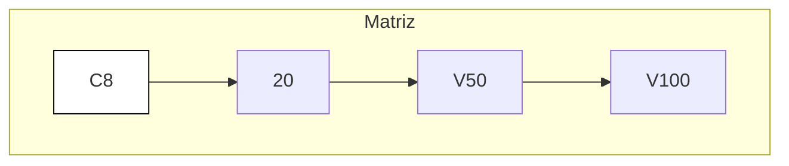

# GAPS_Crystal

```mermaid
graph TD
  subgraph Matriz
A1["C8"]:::branco --> A2["20"]:::amarelo --> A3["V50"]:::laranja --> A4["V100"]:::vermelho
  end

classDef branco fill:#fff, stroke:#000, stroke-width:1px;
```
