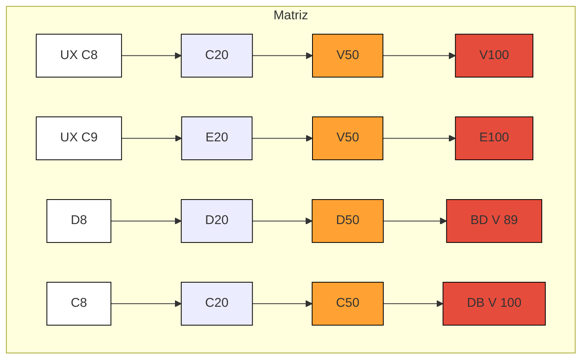

# GAPS_Crystal

```mermaid
graph TD
  subgraph Matriz
A1["UX C8"]:::branco --> A2["C20"]:::amarelo --> A3["V50"]:::laranja --> A4["V100"]:::vermelho
B1["UX C9"]:::branco --> B2["E20"]:::amarelo --> B3["V50"]:::laranja --> B4["E100"]:::vermelho
C1["D8"]:::branco --> C2["D20"]:::amarelo --> C3["D50"]:::laranja --> C4["BD V 89"]:::vermelho
D1["C8"]:::branco --> D2["C20"]:::amarelo --> D3["C50"]:::laranja --> D4["DB V 100"]:::vermelho
  end

classDef branco fill:#fff, stroke:#000, stroke-width:1px;
classDef amarelo fill:##FFFF99, stroke:#000, stroke-width:1px;
classDef laranja fill:#FFA233, stroke:#000, stroke-width:1px;
classDef vermelho fill:#E64C3C, stroke:#000, stroke-width:1px;
```
